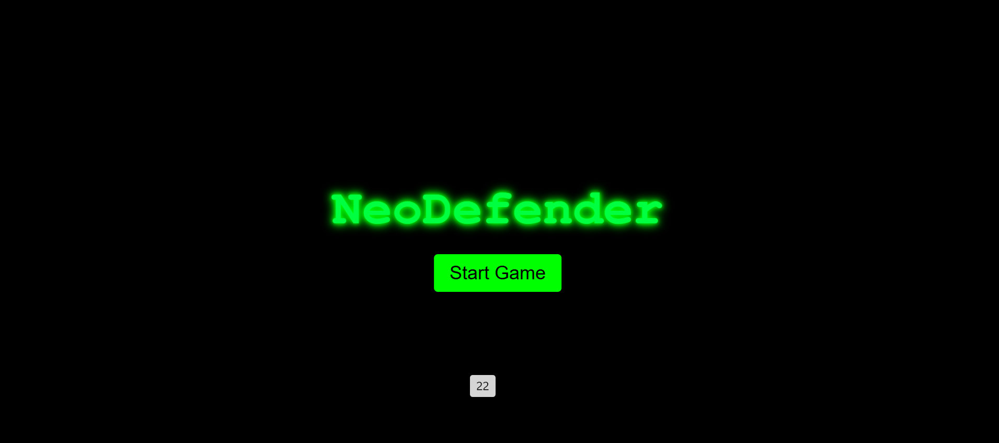
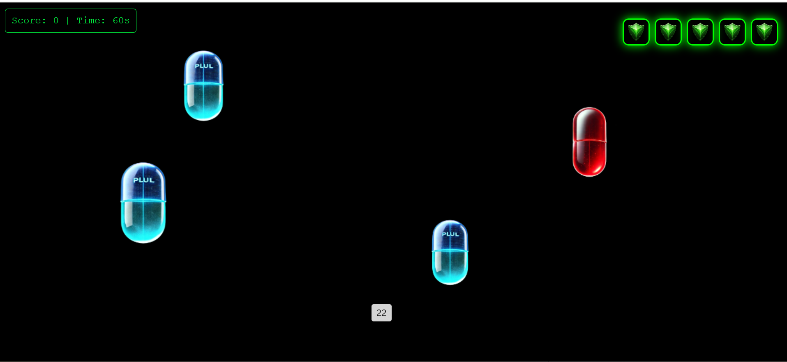

# NeoDefender 

Welcome to **NeoDefender**, a game inspired by the movie *The Matrix*. In this game, you control Neo as he navigates through falling pills while trying to save the matrix as long as possible. The goal is to avoid "red pills" and catch "blue pills" to gain points, while managing shields and keeping an eye on the timer.

The reason I choose to create the game is due the inspiration The Matrix series has over, and I wanted to bring that into reality as a game inspired by it. 
## Features
- **Falling Objects**: Red and blue pills fall from the top of the screen, which players must interact with to gain or lose shields.
- **Score Tracking**: Track your score, high score, and the time left in the game.
- **Background Music**: Music plays throughout the game to enhance the experience.
- **Shields**: Protect yourself from losing by collecting blue pills, but be careful not to click on red pills.

## Installation

To get started with NeoDefender, follow these steps:

1. **Clone the repository**:

    ```bash
    git clone https://github.com/your-username/neodefender.git
    ```

2. **Open the project folder**:

    ```bash
    cd neodefender
    ```

3. **Open the index.html file in your browser**.

    You can also host it locally using a simple HTTP server if you prefer.

## How to Play

1. **Start the game** by clicking the "Are You Ready, Neo?" button.
2. **Catch blue pills** to gain points and protect yourself.
3. **Avoid red pills** to prevent losing shields.
4. **Keep an eye on the timer** to track how much time you have left before the game ends.
5. Once you lose all shields or time runs out, the game ends, and your score is displayed.

## Technologies Used
- **HTML5**: Structure of the game.
- **CSS3**: Styling and layout.
- **JavaScript**: Game logic and interactivity.


## Next Steps: 
- Add Matrix-themed background
- Create a level-up system
- Progress the story of the game
- Add sound effects while the player is playing
- Make the game mobile-responsive
- Improve pill-clicking functionality, especially for mouse or touchpad users 

## Attributions: 
- Canvas API:  https://developer.mozilla.org/en-US/docs/Web/API/Canvas_API 
- Fruit Fall Game | Javascript Project Speed Coding
 ((Game Logic))https://youtu.be/HMaeisq_wpA?si=2SdoRCvhKlL8o0J8 
- ChatGPT (Image Generator): https://chatgpt.com/g/g-pmuQfob8d-image-generator
- ChatGPT: Used in several ways, such as, enhancing the story part text, and assisting in organizing and preparing the game logic. 
- Soundtrack:  https://youtu.be/GOVS6iCJ52s?si=QNUICVO_OsOhwLkk 






Enjoy the game and good luck, Neo!
